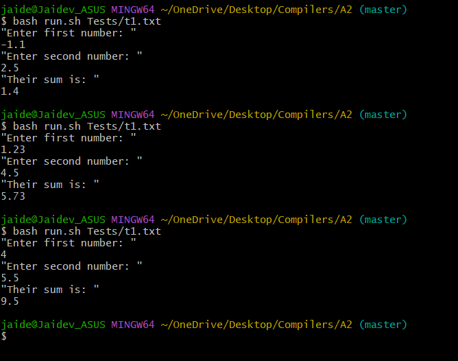

# Assignment 2

- Jaidev Sanjay Khalane
- 22110103

## Folder Structure
```
Assignment 2
    |
    +------src
    |       |
    |       +--- astDefiner.py
    |       +--- lexer.py
    |       +--- parser.py
    |
    +------Tests
    |       |
    |       +--- t1.txt
    |       +--- t2.txt
    |       .
    |       .
    |       .
    |
    +-------LexerTester.py
    +-------ParserTester.py
    +-------MainRunner.py
    +-------run.sh
    +-------README.md 
```

## Directions to Run
```
py .\MainRunner.py .\Tests\t1.txt
```

Replace py with python3 for linux devices

```
bash run.sh <filename>
```
Replace py with python3 in run.sh for linux devices

Example: ```bash run.sh 'Tests/t1.txt'```

- Execution in Progress


## Supported Type
- Decimal Numbers
    - Integers
    - Floats
    - Negative Integers
    - Negative Floats
- Strings
    - "Strings"
    - Escape characters:
        - \n
        - \t
        - \"
        - \\
- Words
    -   ```+``` : Pops two numbers and adds them. Pushes results back to the stack.
    -   ```-``` : Pops two numbers and subtracts them. Pushes results back to the stack.
    -   ```*``` : Pops two numbers and multiples them. Pushes results back to the stack.
    -   ```/``` : Pops two numbers and divides them. Pushes results back to the stack.
    -   ```^``` : Pops two numbers and performs exponentiation. Pushes results back to the stack.
    -   ```get``` : Takes user input and pushes to the stack. "string" and number.
    -   ```put``` : Prints the top of the stack.  "string" and number.
    -   ```print``` : Prints the top (string) of the stack.  string.
    -   ```pop``` : Pops the top of the stack.
    -   ```dup``` : Duplicates the top of the stack.
    -   ```rot``` : Rotates the top two elements of the stack.
    -   ```concat``` : Concatenates top two (strings) of the stack and pushes them back.

## Testing
- Lexer Testing
```py LexerTester.py```

- Parser + Lexer Testing
```py ParserTester.py```

- Complete Execution
```py .\MainRunner.py .\Tests\t1.txt```
